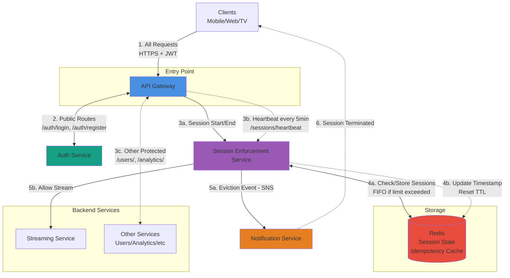

# Concurrent Streams Enforcement Service - Architecture

## High-Level Architecture



**Flow Explanation:**
1. Client sends all requests to Gateway with JWT token (except login/register)
   - For session start: includes `Idempotency-Key` header for retry safety
   - Gateway generates/forwards `X-Request-ID` for tracing
2. Public routes (login/register) go to Auth Service to get JWT
3. Protected routes: Gateway validates JWT locally, then routes based on path:
   - 3a: Session start/end → Session Enforcement Service
   - 3b: Heartbeat (every 5 minutes while app open) → Session Enforcement Service
   - 3c: Other routes → Other Services (bypass enforcement)
4. Session Enforcement operations:
   - 4a: Check/store session count in Redis (with idempotency cache check)
   - 4b: Heartbeat updates timestamp in ZSET, resets 24h TTL
5. Based on session start result:
   - 5a: If limit exceeded → Send eviction event to Notification Service
   - 5b: If valid → Allow stream to Streaming Service
6. Notification Service pushes "Session Terminated" message to evicted client

## Components

### 1. API Gateway
- Entry point for all requests
- **Validates JWT tokens locally using public key** (no Auth Service call per request)
- Routes public vs protected requests
- Handles load balancing and rate limiting
- Adds `userId` to request headers after validation

**Routing Rules:**
- `/api/auth/login`, `/api/auth/register` → Auth Service (public)
- `/api/sessions/*` → Session Enforcement Service (protected, JWT validated)
- `/api/stream/*` → Session Enforcement Service (protected, JWT validated)
- `/api/users/*`, `/api/analytics/*` → Other Services (protected, JWT validated)

**JWT Validation Flow:**
1. Receives request with JWT token
2. Generates or extracts `X-Request-ID` (UUID v4) for request tracing
   - If client provides `X-Request-ID`, use it (for client-side correlation)
   - Otherwise, generate new UUID
3. Validates signature using Auth Service's public key (cached)
4. Checks expiration
5. Extracts `userId` from token payload
6. Adds headers for downstream services:
   - `X-User-Id: {userId}` (from JWT)
   - `X-Request-ID: {requestId}` (for tracing)
   - `Idempotency-Key: {key}` (if present, for retry safety)
7. Forwards to appropriate service

**Why Validate at Gateway?**
- **Fail Fast**: Reject invalid tokens immediately
- **Performance**: No Auth Service call per request (~10ms vs ~50ms)
- **Security**: Internal services never see unauthenticated requests
- **Reduced Load**: Auth Service only handles login/register
- **Observability**: Single point for request ID generation and tracing

### 2. Auth Service
- **Handles identity management** (separate from session enforcement)
- User registration and login
- JWT token issuance and validation
- Password management, 2FA, OAuth
- User profile and permissions


**Why Separate?**
- Different security domain (handles credentials)
- Used across entire platform, not just streaming
- Different scaling characteristics (login is less frequent)

### 3. Session Enforcement Service
- **Enforces business rules for concurrent streams** (for authenticated users only)
- **Infrastructure**: ECS with Fargate launch type (serverless containers)
- **Assumes user is already authenticated** (trusts Gateway validation)
- Receives `userId` from Gateway in request headers
- Enforces maximum 2 concurrent sessions per user
- Uses Redis for fast session validation (<100ms)
- Stateless and horizontally scalable
- Implements FIFO eviction (oldest session removed when limit exceeded)

**Why Fargate?**
- No cold starts (unlike Lambda) - maintains persistent Redis connections
- Serverless - no EC2 instance management
- Auto-scales based on traffic
- Cost-effective with variable load
- Perfect for stateless microservices

**API:**
- `POST` `/sessions/start` - Start new session
  - Required headers: `X-User-Id` (from Gateway), `X-Request-ID` (from Gateway), `Idempotency-Key` header for retry safety (from client)
  - Returns: `{sessionId, expiresAt, currentCount}`
  - Response headers: `X-Request-ID` (echoed back for client-side correlation)
- `POST` `/sessions/heartbeat` - Keep session alive (sent every 5 minutes while app open)
  - Required headers: `X-User-Id` (from Gateway), `X-Request-ID` (from Gateway)
  - Body: `{sessionId}`
  - Returns: `200 OK` or `404` if session evicted/expired
  - Response headers: `X-Request-ID`
- `DELETE` `/sessions/end` - End session
  - Required headers: `X-User-Id` (from Gateway), `X-Request-ID` (from Gateway)
  - Body: `{sessionId}`
  - Response headers: `X-Request-ID` (echoed back)

**Idempotency Protection:**
- Client includes `Idempotency-Key` header (UUID) when starting sessions
- Service caches responses for 5 minutes using key: `idempotency:{userId}:{key}`
- Network retries with same key return cached response (same sessionId)
- Prevents duplicate sessions from network timeouts/retries

**Session Enforcement Flow:**
1. Receives request from Gateway with headers: `X-User-Id`, `X-Request-ID`, `Idempotency-Key` (already validated)
2. Logs request with requestId for traceability
3. Checks idempotency cache `Idempotency-Key`
   - Cache hit → Return cached response immediately (includes requestId in logs)
   - Cache miss → Continue to step 4
4. No additional authentication check needed (trusts Gateway)
5. Generates unique sessionId (server-controlled)
6. Uses `userId` to check/enforce session limits in Redis via atomic Lua script
7. Caches successful response for idempotency (5 min TTL)
8. Logs response with requestId, sessionId, and result
9. Returns session validation result with `X-Request-ID` in response headers

**Deployment Configuration:**
- **Container**: Docker image with application code
- **Launch Type**: Fargate (serverless)
- **Min Tasks**: 3 (across multiple AZs for high availability)
- **Max Tasks**: determined via load testing and capacity planning
- **Scaling Strategy**:
  - Business metrics: Active session validations/sec per task
  - SLA metrics: P99 response time (<100ms requirement)
  - Resource metrics: CPU utilization as safety net
- **Network**: Same VPC as Redis for sub-millisecond latency

### 4. Redis
- Stores active sessions per user
- **Provides persistence across restarts** (see persistence strategy below)
- Sub-millisecond operations for fast validation
- Automatic session expiration (TTL)

**Data:**
```
# Active sessions (ZSET for FIFO eviction)
Key: session:{userId}:active
Value: Sorted Set of sessionIds (score = timestamp)
Max: 2 sessions per user

# Session metadata (Hash)
Key: session:metadata:{sessionId}
Value: {deviceId, deviceType, startTime, ipAddress, userAgent}

# Idempotency cache (String)
Key: idempotency:{userId}:{idempotencyKey}
Value: Cached response JSON
TTL: 5 minutes
```

**Persistence Strategy:**

The architecture ensures session data persists through restarts via multiple layers:

1. **Stateless Service Design**:
   - Session Enforcement Service stores NO state in containers
   - All session data lives in Redis
   - Fargate container restarts → No data loss

2. **Redis Persistence (AWS ElastiCache)**:
   - **RDB (Snapshots)**: Periodic backups to disk (e.g., every 5 minutes)
   - **AOF (Append Only File)**: Logs every write operation for replay after restart

3. **Multi-AZ Replication**:
   - Primary Redis node + read replicas across availability zones
   - Automatic failover if primary fails
   - Data replicated in real-time

**Data Persistence Scenarios:**

Session data remains safe in these failure scenarios:

1. **Fargate container restarts** → Data stored in Redis, not in containers
2. **Redis process restarts** → Data restored from disk backups (RDB + AOF)
3. **Redis server failures** → Automatic failover to replica Redis servers
4. **Data center outages** → Multi-AZ deployment ensures continuity

**Configuration:**
- **Persistence**: RDB + AOF enabled
- **Replication**: Multi-AZ with automatic failover
- **Backup Retention**: 7 days (configurable)
- **Recovery Time Objective (RTO)**: < 5 minutes
- **Recovery Point Objective (RPO)**: < 1 second (AOF with everysec)

### 5. Notification Service
- **Sends real-time notifications to clients** about session events
- Notifies users when their session is evicted due to concurrent limit

**Communication with Session Enforcement Service:**

The services communicate via an **asynchronous event-driven pattern** using AWS SNS + SQS:

```
Session Enforcement Service
    ↓ (publishes event)
AWS SNS Topic: "session-evicted-events"
    ↓ (automatically forwards)
AWS SQS Queue: "notification-queue"
    ↑ (polls for messages)
Notification Service
```

**How It Works:**

1. **Event Publishing (Session Enforcement → SNS)**
   - When eviction occurs, Session Enforcement publishes event to SNS topic
   - Returns immediately (~20ms) - fire and forget
   - Does NOT wait for notification delivery
   - Maintains <100ms SLA for session operations

2. **Message Routing (SNS → SQS)**
   - SNS automatically forwards message to subscribed SQS queue
   - Message persisted in queue (won't be lost if Notification Service is down)
   - Happens in background, transparent to Session Enforcement

3. **Message Consumption (Notification Service polls SQS)**
   - Notification Service continuously polls SQS queue (long polling)
   - Retrieves messages when available
   - Processes at its own pace (decoupled from Session Enforcement)

**Eviction Notification Flow:**
1. Session Enforcement Service detects limit exceeded
2. Identifies evicted session (oldest via FIFO)
3. Sends eviction event to Notification Service
4. Notification Service pushes message to client: "Your session was terminated - another device started streaming"
5. Client displays message and stops playback
